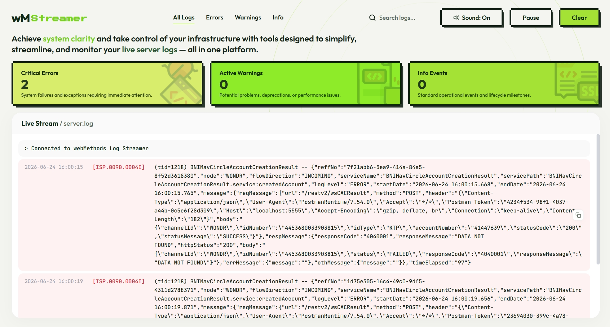

# webMethods Log Streamer

Aplikasi web sederhana untuk memantau (streaming) log dari server webMethods secara real-time. Aplikasi ini menampilkan log dengan antarmuka yang modern, memiliki fitur pencarian, filter berdasarkan tingkat keparahan (Error, Warning, Info), dan notifikasi suara.

## Persyaratan Sistem

Untuk menjalankan aplikasi ini, komputer Anda harus memiliki **Node.js**.
Jika komputer Anda belum terinstal Node.js, ikuti langkah-langkah di bawah ini.

### 1. Cara Instalasi Node.js (Bagi yang belum punya)

1. Buka browser dan kunjungi situs resmi Node.js: https://nodejs.org/
2. Unduh versi **LTS (Long Term Support)** untuk Windows.
3. Buka file instalasi (`.msi`) yang baru saja diunduh.
4. Klik "Next" terus menerus hingga proses instalasi selesai (gunakan pengaturan bawaan/default).
5. Untuk memastikan Node.js sudah terinstal, buka **Command Prompt (CMD)** dan ketik:
   `node -v`
   (Jika muncul angka versi seperti v20.x.x, berarti instalasi berhasil).

---

## Cara Menjalankan Aplikasi

Jika Node.js sudah terinstal, ikuti langkah-langkah berikut untuk mengatur dan menjalankan Log Streamer:

### 1. Instalasi Dependensi (Hanya dilakukan sekali)

1. Buka folder tempat aplikasi ini berada menggunakan File Explorer.
2. Klik *address bar* (kolom alamat letak folder) di bagian atas layar, hapus isinya, lalu ketik `cmd` dan tekan **Enter**. Ini akan membuka layar hitam Command Prompt.
3. Pada Command Prompt, ketik perintah berikut lalu tekan Enter:
   `npm install`
4. Tunggu beberapa saat hingga proses *download* selesai.

### 2. Mengatur Lokasi File Log (Wajib disesuaikan)

Secara bawaan, aplikasi ini mencari log di `C:\SoftwareAG\IntegrationServer\instances\default\logs\server.log`. Jika lokasi log Anda berbeda, ubah pengaturannya:
1. Buat sebuah file baru bernama `.env` di dalam folder aplikasi ini.
2. Buka file `.env` tersebut menggunakan Notepad.
3. Tambahkan baris berikut ke dalamnya dan sesuaikan dengan alamat log Anda. Gunakan garis miring ganda (\\) atau garis miring biasa (/) untuk memisahkan folder:
   `LOG_FILE_PATH=C:\Lokasi\Server\Anda\logs\server.log`
4. Simpan file `.env` tersebut.

### 3. Menjalankan Server

1. Pastikan Anda masih berada di dalam Command Prompt (atau buka lagi seperti langkah 1.2).
2. Ketik perintah berikut lalu tekan Enter:
   `node server.js`
3. Anda akan melihat pesan yang menandakan server berjalan (biasanya di port 3000).

### 4. Membuka Aplikasi di Browser

1. Buka browser (Chrome, Edge, Firefox, dll).
2. Ketikkan alamat berikut di bagian atas browser:
   `http://localhost:3000`
3. Aplikasi webMethods Log Streamer Anda sudah siap digunakan!

---

## Cara Mematikan Aplikasi
Untuk mematikan aplikasi, buka kembali layar hitam Command Prompt tempat Anda menjalankan `node server.js`, lalu tekan tombol `Ctrl + C` secara bersamaan di keyboard Anda. Ketik `Y` lalu Enter jika ada konfirmasi penutupan.
